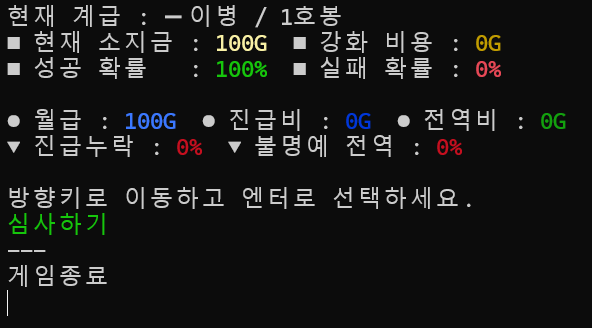
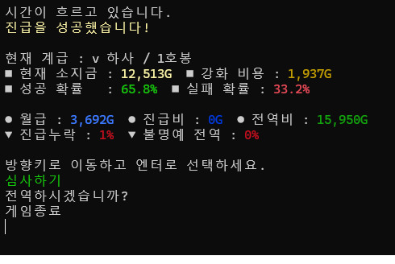
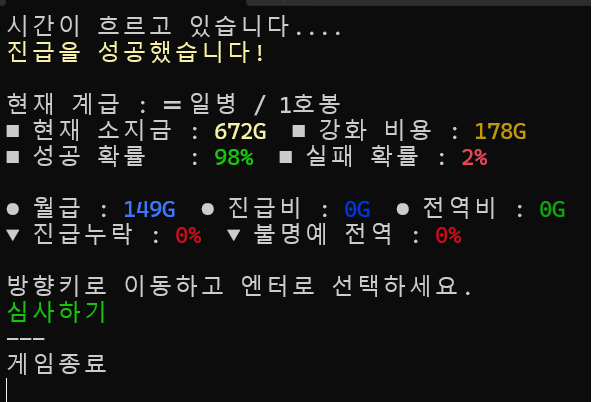
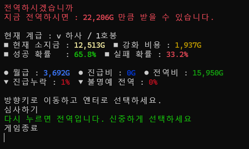

# 행복한 군 생활
---------

## 게임 설명
- **[병사]** 부터 시작 해 최고 간부인 **[대장]** 까지 진급에 성공하면 클리어하는 게임입니다.
- **[진급]** 을 하면서 **[진급누락]** , **[불명예전역]** 의 방해 요소가 존재하며, 방해 요소를 뚫어 내어 **[대장]** 까지 도달하여 마지막 전역을 하는 것이 목표입니다.

## 게임 시스템 설명 

- **[진급]** 을 하기 위해선 **[진급심사]** 를 봐야합니다.
- 정해진 **[확률]** 에 의해서 **[진급심사]** 가 진행되고 특정 구간(간부)부터는 진급에 실패할 시 **[진급누락]** 과 **[불명예전역]** 을 당할 수 있습니다.

- **[간부]** 부터 **[진급심사]** 에 실패할 시 일정 확률로 **[진급누락]** 과 **[불명예전역]** 을 당할 수 있습니다.
- **[진급누락]** 은 **[현]** 계급&호봉에서 **[전]** 계급&호봉으로 **[강등]** 당합니다.
- **[불명예전역]** 은 **[현]** 계급&호봉에서 **[강제]** 로 **[전역]** 하게 되는 것이며, 만약 당하게 된다면 모든 재산을 몰수 당합니다.

- **[진급]** 에 성공할 시 **[계급&호봉]** 에 맞는 **[월급]** 을 주고 **[계급단계]** , 즉 호봉이 아닌 계급 자체가 올라갈 시 **[진급비]** 를 지급합니다.

- 낮은 확률과 부족한 돈으로 **[진급심사]** 가 어려울 경우엔 **[전역]** 을 하여 부족한 돈을 채워 나갈 수 있습니다.
- **[전역]** 은 **[부사관]** 부터 진행할 수 있으며 **[병사]** 는 진행할 수 없습니다.

